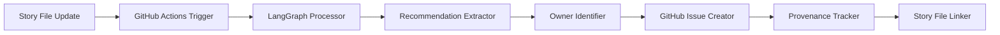

# Automated Recommendation Routing System Design

## **Executive Summary**

**Problem**: QA recommendations and agent feedback can be lost without systematic tracking, assignment, and follow-up.

**Solution**: Automated system using LangGraph + GitHub Actions to extract, route, and track recommendations with complete provenance.

**Business Value**: Zero recommendation loss, automated accountability, and systematic improvement cycles.

## **Architecture Overview**

### **System Components**



### **Core Workflow**

1. **Trigger**: Story file commit in `docs/stories/**`
2. **Extract**: Parse QA Results sections for recommendations
3. **Route**: Identify appropriate owners based on recommendation type
4. **Create**: Generate GitHub issues with proper labels and assignments
5. **Link**: Maintain bidirectional references between issues and stories
6. **Track**: Monitor resolution and update story files

## **Technical Implementation**

### **1. LangGraph Workflow Nodes**

#### **RecommendationExtractor Node**
```python
class RecommendationExtractor:
    """Extract actionable recommendations from story QA sections"""

    async def process(self, story_content: str) -> List[Recommendation]:
        # Parse QA Results section
        # Identify recommendation patterns:
        # - "✅ Implement: ..."
        # - "🔄 Monitor: ..."
        # - "📋 Future: ..."
        # - Priority indicators (HIGH/MEDIUM/LOW)
        return recommendations

class Recommendation(BaseModel):
    id: str
    text: str
    priority: Priority  # HIGH, MEDIUM, LOW
    category: Category  # IMPLEMENTATION, MONITORING, FUTURE
    source_story: str
    source_version: str
    commit_hash: str
    date_created: datetime
```

#### **OwnerIdentifier Node**
```python
class OwnerIdentifier:
    """Map recommendations to appropriate team members"""

    ROUTING_RULES = {
        "implementation": ["@james", "@alex"],  # Dev + Architect
        "monitoring": ["@quinn", "@john"],     # QA + PM
        "architecture": ["@alex", "@james"],   # Architect + Dev
        "process": ["@john", "@quinn"],        # PM + QA
        "testing": ["@quinn"],                 # QA only
        "documentation": ["@john"]             # PM only
    }

    async def identify_owner(self, recommendation: Recommendation) -> List[str]:
        # Analyze recommendation text
        # Apply routing rules
        # Return GitHub usernames for assignment
        return owners
```

#### **IssueCreator Node**
```python
class IssueCreator:
    """Create GitHub issues with proper formatting"""

    async def create_issue(self, recommendation: Recommendation, owners: List[str]) -> GitHubIssue:
        issue = {
            "title": f"[{recommendation.priority}] {recommendation.text[:50]}...",
            "body": self._format_issue_body(recommendation),
            "labels": self._get_labels(recommendation),
            "assignees": owners,
            "milestone": self._determine_milestone(recommendation)
        }
        return await github_client.create_issue(issue)

    def _format_issue_body(self, rec: Recommendation) -> str:
        return f"""
## Recommendation Details
**Priority**: {rec.priority}
**Category**: {rec.category}
**Source Story**: [{rec.source_story}](../docs/stories/{rec.source_story})
**Version**: {rec.source_version}
**Commit**: {rec.commit_hash}

## Recommendation
{rec.text}

## Acceptance Criteria
- [ ] Implementation complete
- [ ] Testing validated
- [ ] Documentation updated
- [ ] Story file updated with completion status

## Provenance
Generated automatically from QA validation results.
"""
```

### **2. GitHub Actions Workflow**

```yaml
# .github/workflows/recommendation-router.yml
name: Automated Recommendation Routing

on:
  push:
    paths: ['docs/stories/**/*.md']

env:
  GITHUB_TOKEN: ${{ secrets.GITHUB_TOKEN }}
  PYTHON_VERSION: '3.11'

jobs:
  route_recommendations:
    runs-on: ubuntu-latest

    steps:
    - name: Checkout Repository
      uses: actions/checkout@v4
      with:
        fetch-depth: 2  # Need previous commit for diff

    - name: Setup Python
      uses: actions/setup-python@v4
      with:
        python-version: ${{ env.PYTHON_VERSION }}

    - name: Install Dependencies
      run: |
        pip install langgraph pydantic pygithub pyyaml

    - name: Detect Changed Story Files
      id: changes
      run: |
        CHANGED_FILES=$(git diff --name-only HEAD~1 HEAD | grep 'docs/stories/' || true)
        echo "changed_files=$CHANGED_FILES" >> $GITHUB_OUTPUT

    - name: Process Recommendations
      if: steps.changes.outputs.changed_files != ''
      run: |
        python .github/scripts/recommendation_processor.py \
          --files "${{ steps.changes.outputs.changed_files }}" \
          --commit-hash "${{ github.sha }}" \
          --repository "${{ github.repository }}"

    - name: Update Story Tracking
      run: |
        # Update story files with issue links
        # Commit tracking updates
        git config --local user.email "action@github.com"
        git config --local user.name "GitHub Action"
        git add docs/stories/
        git diff --staged --quiet || git commit -m "Auto-update: Link recommendations to issues"
        git push
```

### **3. Recommendation Processing Script**

```python
# .github/scripts/recommendation_processor.py
import asyncio
import yaml
from typing import List, Dict
from pathlib import Path
from langgraph import StateGraph, CompiledGraph

class RecommendationRouter:
    """Main orchestration class for recommendation routing"""

    def __init__(self):
        self.graph = self._build_langgraph()

    def _build_langgraph(self) -> CompiledGraph:
        """Build LangGraph workflow for recommendation processing"""

        workflow = StateGraph(RecommendationState)

        # Add nodes
        workflow.add_node("extract", RecommendationExtractor())
        workflow.add_node("identify", OwnerIdentifier())
        workflow.add_node("create_issues", IssueCreator())
        workflow.add_node("update_tracking", ProvenanceTracker())

        # Define edges
        workflow.add_edge("extract", "identify")
        workflow.add_edge("identify", "create_issues")
        workflow.add_edge("create_issues", "update_tracking")

        # Set entry point
        workflow.set_entry_point("extract")
        workflow.set_finish_point("update_tracking")

        return workflow.compile()

    async def process_story_file(self, file_path: str, commit_hash: str) -> Dict[str, Any]:
        """Process a single story file for recommendations"""

        initial_state = RecommendationState(
            story_file=file_path,
            commit_hash=commit_hash,
            recommendations=[],
            created_issues=[],
            tracking_updates=[]
        )

        result = await self.graph.ainvoke(initial_state)
        return result

class RecommendationState(TypedDict):
    story_file: str
    commit_hash: str
    recommendations: List[Recommendation]
    created_issues: List[GitHubIssue]
    tracking_updates: List[str]
```

### **4. Provenance Tracking**

#### **Story File Updates**
```markdown
## Recommendation Tracking

### Generated Issues
- [#123](https://github.com/org/repo/issues/123) - Monitor runtime behavior (MEDIUM) - Assigned: @quinn
- [#124](https://github.com/org/repo/issues/124) - Consider integration tests (LOW) - Assigned: @james

### Resolved Recommendations
- ✅ [#122](https://github.com/org/repo/issues/122) - Implement 3-phase refactoring (HIGH) - Completed: 2025-09-22
```

#### **Issue-to-Story Linking**
- **Issue Body**: Contains direct link to source story file + version
- **Story Updates**: Automatic updates when issues are created/resolved
- **Commit References**: Preserve exact context of recommendation origin

## **Routing Rules Configuration**

### **Recommendation Categories**
```yaml
routing_rules:
  implementation:
    keywords: ["implement", "code", "develop", "build"]
    owners: ["@james", "@alex"]
    priority_mapping:
      HIGH: "P1"
      MEDIUM: "P2"
      LOW: "P3"

  monitoring:
    keywords: ["monitor", "observe", "track", "measure"]
    owners: ["@quinn", "@john"]
    priority_mapping:
      HIGH: "P2"
      MEDIUM: "P3"
      LOW: "P4"

  architecture:
    keywords: ["architecture", "design", "structure", "refactor"]
    owners: ["@alex", "@james"]
    priority_mapping:
      HIGH: "P1"
      MEDIUM: "P2"
      LOW: "P3"

  process:
    keywords: ["workflow", "process", "coordination", "systematic"]
    owners: ["@john", "@quinn"]
    priority_mapping:
      HIGH: "P2"
      MEDIUM: "P3"
      LOW: "P4"
```

### **Label Strategy**
```yaml
labels:
  priority:
    - "priority/high"
    - "priority/medium"
    - "priority/low"

  category:
    - "type/implementation"
    - "type/monitoring"
    - "type/architecture"
    - "type/process"

  source:
    - "source/qa-recommendation"
    - "source/story-v1"

  status:
    - "status/routed"
    - "status/in-progress"
    - "status/completed"
    - "status/deferred"
```

## **Benefits & Success Metrics**

### **Immediate Benefits**
- **Zero Recommendation Loss**: All QA recommendations automatically tracked
- **Automated Accountability**: Clear owner assignment with GitHub notifications
- **Complete Provenance**: Bidirectional links between recommendations and stories
- **Systematic Follow-up**: Automated tracking of resolution status

### **Success Metrics**
- **Recommendation Resolution Rate**: % of generated issues completed within sprint
- **Response Time**: Average time from recommendation to initial action
- **Quality Improvement**: Reduction in recurring recommendation themes
- **Process Efficiency**: Time saved on manual recommendation tracking

### **Long-term Value**
- **Continuous Improvement**: Systematic capture and resolution of improvement opportunities
- **Team Coordination**: Clear accountability and reduced communication overhead
- **Quality Evolution**: Data-driven insights into recurring quality patterns
- **Knowledge Preservation**: Complete audit trail of quality decisions and outcomes

## **Implementation Phases**

### **Phase 1: Basic GitHub Actions (Week 1)**
- GitHub Actions workflow for story file changes
- Simple recommendation extraction with regex patterns
- Manual owner mapping configuration
- Basic issue creation with minimal formatting

### **Phase 2: LangGraph Integration (Week 2)**
- LangGraph workflow implementation
- Intelligent recommendation categorization
- Advanced owner identification logic
- Rich issue formatting with provenance

### **Phase 3: Bidirectional Tracking (Week 3)**
- Story file updates with issue links
- Automatic resolution tracking
- Status synchronization between issues and stories
- Analytics dashboard for recommendation metrics

### **Phase 4: Advanced Features (Week 4)**
- ML-based recommendation prioritization
- Custom routing rules per team/project
- Integration with Linear project management
- Automated milestone assignment

## **Risk Mitigation**

### **Potential Issues**
- **False Positives**: Non-recommendations identified as recommendations
- **Owner Conflicts**: Multiple valid owners for single recommendation
- **Spam Prevention**: Too many low-priority issues created

### **Mitigation Strategies**
- **Confidence Scoring**: Only create issues above confidence threshold
- **Human Review**: Optional review step for ambiguous recommendations
- **Rate Limiting**: Maximum issues per story file or time period
- **Category Filtering**: Allow disabling certain recommendation types

## **Future Enhancements**

### **AI-Powered Features**
- **Smart Prioritization**: ML model trained on resolution patterns
- **Context Understanding**: Better categorization using LLM analysis
- **Similarity Detection**: Group related recommendations across stories
- **Predictive Routing**: Learn optimal owner assignments over time

### **Integration Opportunities**
- **Linear Sync**: Automatic Linear issue creation for roadmap items
- **Slack Notifications**: Real-time team updates on new recommendations
- **Analytics Platform**: Advanced metrics and trending analysis
- **Version Control**: Track recommendation evolution across story versions

---

**This design establishes a comprehensive system for automated recommendation routing that ensures zero loss while maintaining complete audit trails and systematic accountability.**