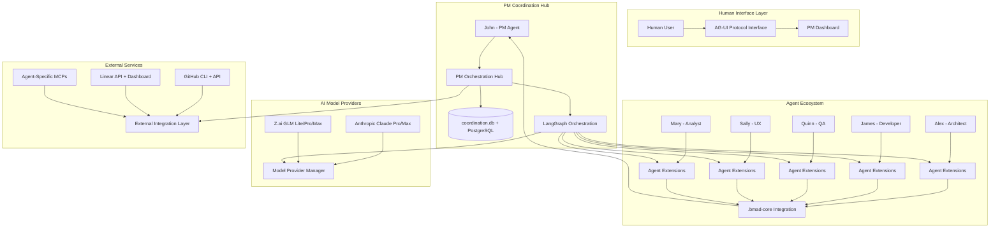
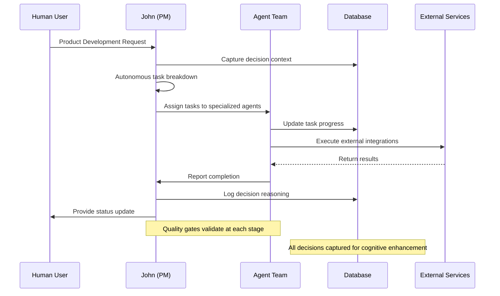
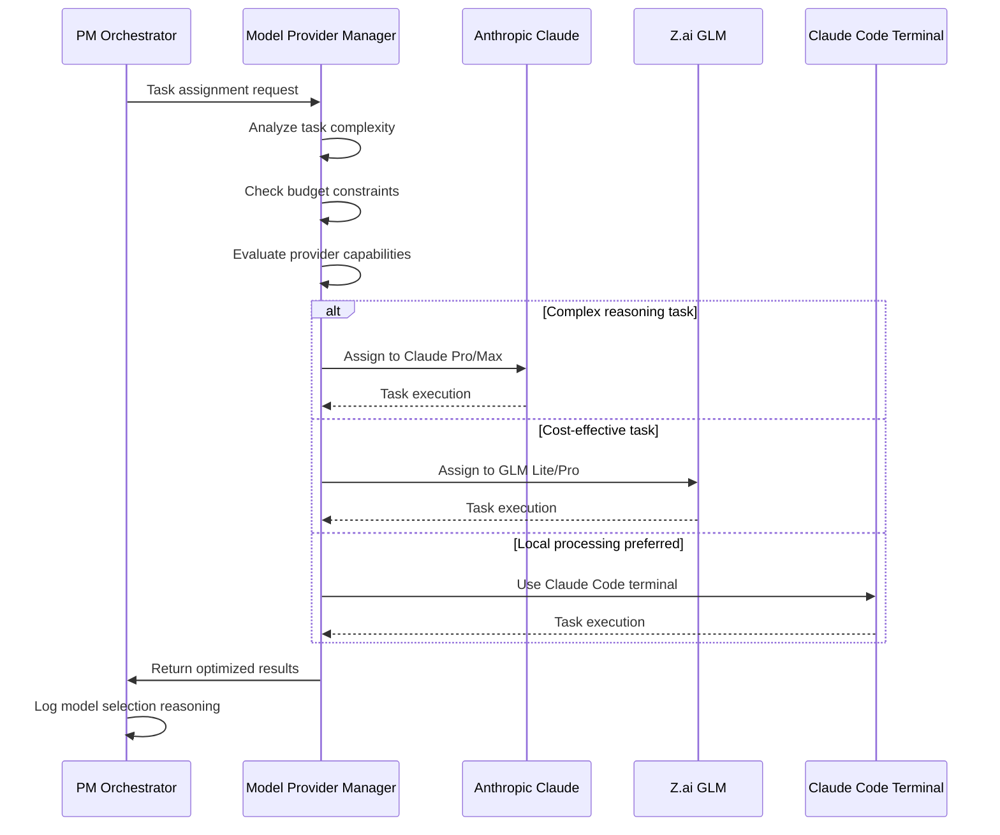

# BMAD Auto Comprehensive Technical Architecture Document

**Version**: 1.0
**Date**: 2025-09-27
**Author**: Winston (Architect)
**Status**: Implementation Ready
**Source**: Complete Planning Session Analysis

## Introduction

This document outlines the complete technical architecture for BMAD Auto, a PM-centric autonomous product orchestration system implementing a 10-agent ecosystem with Context Engineering cognitive framework. The architecture synthesizes all technical decisions from the comprehensive planning session (session-2025-09-27-alex-human-spec-kit-architecture-coordination.md) and provides implementation-ready specifications for Spec Kit compatibility.

This unified approach combines Database-Driven State Management, LangGraph Orchestration, Multi-Provider AI Model Integration, and External Service Integration while maintaining 100% .bmad-core preservation through an extension overlay pattern.

### Architecture Foundation

**System Type**: Pure BMAD Autonomous Orchestration System
**Core Approach**: MD/YAML-First Implementation with LangGraph orchestration
**Integration Strategy**: Brownfield enhancement preserving 100% backward compatibility
**Size Compliance**: 100-300 line agent file limits with modular orchestration

### Change Log

| Date | Version | Description | Author |
|------|---------|-------------|---------|
| 2025-09-27 | 1.0 | Complete architecture based on planning session analysis | Winston (Architect) |

## High Level Architecture

### Technical Summary

BMAD Auto implements a **database-driven, LangGraph-orchestrated autonomous system** that enhances the proven .bmad-core framework with sophisticated multi-agent coordination capabilities. The architecture uses **PostgreSQL for persistent state management** with **LangGraph workflows** providing intelligent orchestration across **10 specialized AI agents** coordinated by **John (PM)** as the central hub. The system integrates **multiple AI model providers** (Anthropic Claude Pro/Max + Z.ai GLM Lite/Pro/Max) with **dynamic model assignment** based on task complexity and budget optimization. **External service integration** follows a **CLI-first approach** with **API fallbacks** for GitHub operations, **hybrid Linear API + Internal Dashboard** for project management, and **agent-specific MCP assignments** with **human-approved tool provisioning**.

### Platform and Infrastructure Choice

**Platform**: Hybrid Cloud + Local Development
**Key Services**:
- **Database**: PostgreSQL (primary) + SQLite (coordination.db extension)
- **Orchestration**: LangGraph + LangSmith monitoring
- **AI Providers**: Anthropic Claude + Z.ai GLM with intelligent switching
- **Version Control**: GitHub CLI + API fallback
- **Project Management**: Linear API + Internal Dashboard hybrid
- **Human-AI Collaboration**: AG-UI Protocol + WebSocket coordination
- **Local Development**: Claude Code terminal integration

**Deployment Host and Regions**: Local development primary, cloud deployment optional

### Repository Structure

**Structure**: Monorepo with BMAD-compliant organization
**Monorepo Tool**: Not applicable (Pure MD/YAML approach)
**Package Organization**: .bmad-auto extension overlay preserving .bmad-core structure

```
Omcaro/
├── .bmad-core/                    # Preserved BMAD core (ZERO MODIFICATIONS)
├── .bmad-auto/                    # BMAD Auto extension overlay
│   ├── agents/                    # Agent extensions (pm-extension.yaml, etc.)
│   ├── workflows/                 # LangGraph workflow definitions
│   ├── tasks/                     # Enhanced task definitions
│   ├── templates/                 # Architecture and planning templates
│   ├── docs/                      # Implementation documentation
│   ├── planning/                  # PRD, architecture, requirements
│   └── intercept/                 # PM coordination system
└── coordination.db                # Extended SQLite database
```

### Architecture Diagram



### Architectural Patterns

- **PM-Centric Orchestration**: All agent coordination flows through John (PM) with database-backed decision reasoning - _Rationale:_ Provides central control and context management for complex multi-agent operations_
- **Database-Driven State Management**: PostgreSQL + SQLite for persistent context and session management - _Rationale:_ Replaces file-based assumptions with robust state persistence across system restarts_
- **Extension Overlay Pattern**: .bmad-core preservation with YAML extension enhancements - _Rationale:_ Maintains 100% backward compatibility while enabling autonomous capabilities_
- **Multi-Provider AI Optimization**: Intelligent model assignment based on task complexity and budget - _Rationale:_ Maximizes performance within budget constraints using different provider strengths_
- **CLI-First Integration**: GitHub CLI with API fallback for reliable external service integration - _Rationale:_ Provides robust integration with graceful degradation_
- **LangGraph Workflow Orchestration**: Smart workflow paths with state management and recovery - _Rationale:_ Enables complex autonomous operations with monitoring and debugging capabilities_

## Tech Stack

### Technology Stack Table

| Category | Technology | Version | Purpose | Rationale |
|----------|------------|---------|---------|-----------|
| **Orchestration Framework** | LangGraph | Latest | Workflow coordination and agent state management | Provides sophisticated workflow orchestration with state persistence and monitoring |
| **Database Primary** | PostgreSQL | 15+ | Multi-agent state management and context storage | Robust ACID compliance for concurrent agent operations |
| **Database Coordination** | SQLite | 3.x | Extended coordination.db for BMAD integration | Preserves existing coordination patterns while enabling extensions |
| **AI Model Provider 1** | Anthropic Claude | Pro/Max | Complex reasoning and Spec Kit integration | Superior performance for architectural and strategic tasks |
| **AI Model Provider 2** | Z.ai GLM | Lite/Pro/Max | Cost-effective task execution with 3x usage limits | Budget optimization for routine and parallel operations |
| **Local AI Integration** | Claude Code Terminal | Current | Primary AI engine for all 10 agents | Seamless local AI processing without external API dependencies |
| **State Management** | LangGraph State | Latest | Workflow state persistence and recovery | Comprehensive state management across system restarts |
| **Monitoring** | LangSmith | Latest | Workflow observability and performance analytics | Complete visibility into LangGraph operations and optimization |
| **Version Control Integration** | GitHub CLI | Latest | CLI-first repository operations with API fallback | Reliable integration with graceful degradation patterns |
| **Project Management** | Linear API | v1 | Hybrid project coordination (free tier: 2 teams, 250 issues) | Professional project management with internal dashboard fallback |
| **Human-AI Collaboration** | AG-UI Protocol | Latest | Real-time collaboration sessions and approvals | Structured human oversight with transparent decision workflows |
| **Agent Tool Access** | MCP Protocol | Latest | Agent-specific tool assignments (Playwright, Search, Context7) | Dynamic tool provisioning with human approval and usage monitoring |
| **Documentation** | Markdown + YAML | Standard | Pure MD/YAML implementation approach | Maintains BMAD philosophy while enabling sophisticated orchestration |
| **Configuration Management** | YAML | 1.2 | Agent extensions and workflow definitions | Structured configuration supporting complex orchestration |

## Data Models

### Core Entities for Multi-Agent Coordination

#### PMDecisionContext
**Purpose**: Captures PM decision-making context and reasoning for cognitive framework enhancement

**Key Attributes**:
- decision_id: string - Unique decision identifier
- context_data: JSON - Complete decision context and inputs
- reasoning_process: string - Step-by-step PM logical reasoning
- outcome: string - Final decision made by PM
- confidence_score: number (1-10) - PM confidence in decision
- learning_notes: string - Notes for future cognitive improvement

```typescript
interface PMDecisionContext {
  decision_id: string;
  decision_type: 'task_assignment' | 'quality_gate' | 'resource_allocation' | 'escalation';
  context_data: Record<string, any>;
  reasoning_process: string;
  outcome: string;
  confidence_score: number;
  agent_assignments?: Record<string, string>;
  resource_optimization?: ResourceAllocation;
  learning_notes?: string;
  created_at: Date;
}
```

**Relationships**:
- Links to TaskBreakdown for assignment decisions
- Links to QualityGateExecution for validation decisions
- Links to ProviderPlanUsage for resource optimization decisions

#### TaskBreakdown
**Purpose**: Represents PM's autonomous task decomposition with specialized agent assignment

**Key Attributes**:
- breakdown_id: string - Unique breakdown identifier
- parent_task: string - Original user prompt or task
- subtasks: SubTask[] - Array of decomposed subtasks
- agent_assignments: Record<string, string> - Capability-based agent assignments
- timeline_estimate: number - Estimated completion time
- resource_requirements: ResourceRequirement[] - Compute and tool requirements

```typescript
interface TaskBreakdown {
  breakdown_id: string;
  parent_task: string;
  subtasks: SubTask[];
  agent_assignments: Record<string, string>;
  timeline_estimate: number;
  resource_requirements: ResourceRequirement[];
  pm_reasoning: string;
  status: 'pending' | 'in_progress' | 'completed' | 'failed';
  created_at: Date;
  updated_at: Date;
}
```

**Relationships**:
- Contains multiple SubTask entities
- Links to AgentCapability for assignment decisions
- Links to PMDecisionContext for reasoning capture

#### AgentExtensionConfig
**Purpose**: Defines agent enhancement configurations maintaining .bmad-core preservation

**Key Attributes**:
- agent_name: string - Core agent identifier (pm, architect, dev, qa, ux, analyst)
- extension_type: string - Type of enhancement (capability, workflow, integration)
- base_agent_hash: string - .bmad-core file integrity verification
- extension_config: JSON - YAML extension configuration
- spec_kit_integration: boolean - Spec Kit command capabilities

```typescript
interface AgentExtensionConfig {
  agent_name: string;
  extension_type: 'capability' | 'workflow' | 'integration' | 'spec_kit';
  base_agent_hash: string;
  extension_config: Record<string, any>;
  spec_kit_integration: boolean;
  is_active: boolean;
  created_at: Date;
  updated_at: Date;
}
```

**Relationships**:
- Links to CoreAgentPreservation for integrity tracking
- Links to SpecKitExecution for command integration
- Links to MCPToolAssignment for tool access management

## API Specification

### LangGraph Workflow API Integration

The BMAD Auto system uses LangGraph orchestration for all API interactions, replacing traditional REST endpoints with intelligent workflow nodes.

```yaml
# LangGraph Workflow API Specification
langgraph_workflows:
  pm_orchestration:
    type: orchestration
    nodes:
      - task_decomposition
      - agent_assignment
      - resource_optimization
      - quality_validation
    edges:
      - from: task_decomposition
        to: agent_assignment
        condition: tasks_valid
      - from: agent_assignment
        to: resource_optimization
        condition: agents_assigned
      - from: resource_optimization
        to: quality_validation
        condition: resources_allocated

  spec_kit_integration:
    type: command_execution
    nodes:
      - command_validation
      - context_preparation
      - agent_execution
      - result_compilation
    edges:
      - from: command_validation
        to: context_preparation
        condition: command_valid
      - from: context_preparation
        to: agent_execution
        condition: context_ready
      - from: agent_execution
        to: result_compilation
        condition: execution_complete

  model_provider_optimization:
    type: provider_management
    nodes:
      - usage_analysis
      - model_selection
      - cost_optimization
      - performance_monitoring
    edges:
      - from: usage_analysis
        to: model_selection
        condition: analysis_complete
      - from: model_selection
        to: cost_optimization
        condition: model_assigned
      - from: cost_optimization
        to: performance_monitoring
        condition: optimization_applied
```

### External Service Integration APIs

```yaml
# GitHub CLI + API Integration
github_integration:
  cli_operations:
    - issue_create: "gh issue create --title '[{agent}] {task}' --body '{description}' --label 'agent:{agent}'"
    - pr_create: "gh pr create --title '[{agent}] Closes #{issue}' --body 'Agent work for issue #{issue}' --head {branch}"
    - branch_create: "git checkout -b agent/{agent}/{issue}-{slug}"
  api_fallback:
    - endpoint: "POST /repos/{owner}/{repo}/issues"
    - endpoint: "POST /repos/{owner}/{repo}/pulls"
    - endpoint: "GET /repos/{owner}/{repo}/issues"

# Linear API + Internal Dashboard
linear_integration:
  api_operations:
    - project_sync: "GET /projects"
    - issue_sync: "GET /issues"
    - team_management: "GET /teams"
  rate_limits:
    requests_per_hour: 1500
    teams_limit: 2
    issues_limit: 250
  fallback_dashboard:
    internal_task_management: true
    project_coordination: true
    agent_status_monitoring: true

# AG-UI Protocol Integration
agui_integration:
  collaboration_sessions:
    - pm_approval_workflow
    - agent_human_collaboration
    - emergency_intervention
  real_time_features:
    - websocket_coordination
    - structured_approvals
    - decision_capture
```

## Components

### PMOrchestrationHub
**Responsibility**: Central coordination hub managing all agent activities, task breakdown, and resource optimization with database-backed decision reasoning

**Key Interfaces**:
- TaskDecompositionAPI: Autonomous task breakdown with PM logic
- AgentAssignmentAPI: Capability-based agent assignment and coordination
- QualityGateAPI: Multi-stage validation with PM decision capture
- ResourceOptimizationAPI: Multi-provider model assignment and budget management

**Dependencies**: LangGraph State Management, coordination.db, PMDecisionCapture, ModelProviderManager

**Technology Stack**: LangGraph workflows + SQLite coordination.db + PostgreSQL state management

### SpecKitIntegrationLayer
**Responsibility**: LangGraph command router providing seamless integration of Spec Kit commands (/specify, /plan, /tasks, /analyze) with BMAD Auto orchestration

**Key Interfaces**:
- SpecKitCommandRouter: Intelligent command processing with database context
- ContextPreparationAPI: Agent context and .bmad-core resource provisioning
- ResultCompilationAPI: Multi-agent result compilation and validation

**Dependencies**: PMOrchestrationHub, AgentExtensionLoader, QualityGateOrchestrator

**Technology Stack**: LangGraph command workflows + YAML configuration + database context integration

### AgentExtensionLoader
**Responsibility**: .bmad-core preservation with extension overlay pattern, enabling agent enhancement while maintaining zero modifications to core files

**Key Interfaces**:
- ExtensionMergerAPI: Base agent + extension overlay + session context + model assignment
- CoreIntegrityAPI: .bmad-core file hash verification and preservation validation
- CapabilityEnhancementAPI: Dynamic capability loading based on task requirements

**Dependencies**: .bmad-core file system, extension YAML configurations, database session management

**Technology Stack**: LangGraph agent factory + YAML extension configs + file integrity monitoring

### ModelProviderManager
**Responsibility**: Multi-provider AI model optimization with intelligent assignment based on task complexity, budget constraints, and provider capabilities

**Key Interfaces**:
- ProviderAssignmentAPI: Task-specific model selection (Claude vs GLM vs local Claude Code)
- UsageOptimizationAPI: Real-time usage monitoring and budget management
- PerformanceAnalyticsAPI: Provider performance tracking and optimization recommendations

**Dependencies**: Anthropic Claude API, Z.ai GLM API, Claude Code terminal integration, usage tracking database

**Technology Stack**: LangGraph provider workflows + API integrations + local terminal orchestration

### QualityGateOrchestrator
**Responsibility**: Comprehensive quality validation pipeline with automated quality gates, measurable validation criteria, and PM decision workflows

**Key Interfaces**:
- QualityValidationAPI: Multi-stage validation (Input → Content → Integration → Approval)
- PMDecisionAPI: Human-in-the-loop approval workflows with reasoning capture
- EscalationAPI: Quality failure escalation with expert engagement

**Dependencies**: PMOrchestrationHub, AG-UI Protocol, agent review systems, quality metrics database

**Technology Stack**: LangGraph quality workflows + AG-UI integration + quality metrics tracking

### ExternalServiceCoordinator
**Responsibility**: Unified external service integration with CLI-first approach, API fallbacks, and comprehensive error handling

**Key Interfaces**:
- GitHubCoordinatorAPI: CLI + API integration for repository operations
- LinearCoordinatorAPI: Project management with internal dashboard fallback
- MCPCoordinatorAPI: Agent-specific tool assignments with human approval workflows

**Dependencies**: GitHub CLI, Linear API, MCP Protocol, AG-UI Protocol, fallback management systems

**Technology Stack**: CLI integration + API clients + LangGraph coordination + error recovery

## Core Workflows

### Complete Product Development Workflow



### Multi-Provider Model Assignment Workflow



## Database Schema

### Extended coordination.db Schema

Based on the planning session analysis, the database schema extends the existing coordination.db with new tables supporting multi-agent coordination:

```sql
-- Multi-Provider Plan Management
CREATE TABLE IF NOT EXISTS provider_plans (
    id INTEGER PRIMARY KEY,
    provider_name TEXT NOT NULL,      -- 'anthropic_claude', 'zai_glm', 'claude_code'
    plan_tier TEXT NOT NULL,          -- 'pro', 'max', 'lite'
    monthly_limit INTEGER,
    usage_count INTEGER DEFAULT 0,
    reset_date DATETIME,
    cost_per_request REAL,
    is_active BOOLEAN DEFAULT 1
);

-- PM Decision Reasoning Capture
CREATE TABLE IF NOT EXISTS pm_decision_log (
    id INTEGER PRIMARY KEY,
    decision_context TEXT NOT NULL,  -- JSON context that led to decision
    decision_type TEXT NOT NULL,     -- 'task_assignment', 'quality_gate', 'resource_allocation'
    reasoning_process TEXT,          -- Step-by-step PM logic
    outcome TEXT,                   -- Final decision made
    confidence_score INTEGER,       -- PM confidence 1-10
    learning_notes TEXT,            -- Notes for future cognitive enhancement
    model_assignments TEXT,         -- JSON of model provider assignments
    created_at DATETIME DEFAULT CURRENT_TIMESTAMP
);

-- Agent Extension Management
CREATE TABLE IF NOT EXISTS agent_extensions (
    id INTEGER PRIMARY KEY,
    agent_name TEXT NOT NULL,        -- 'pm', 'dev', 'architect', etc.
    extension_type TEXT NOT NULL,    -- 'capability', 'workflow', 'integration', 'spec_kit'
    extension_config TEXT,          -- JSON configuration
    base_agent_hash TEXT,           -- .bmad-core file integrity
    spec_kit_enabled BOOLEAN DEFAULT 0,
    is_active BOOLEAN DEFAULT 1,
    created_at DATETIME DEFAULT CURRENT_TIMESTAMP
);

-- LangGraph Workflow State Persistence
CREATE TABLE IF NOT EXISTS langgraph_executions (
    id INTEGER PRIMARY KEY,
    execution_id TEXT UNIQUE NOT NULL,
    workflow_name TEXT NOT NULL,
    execution_status TEXT DEFAULT 'running',
    trigger_type TEXT NOT NULL,      -- 'manual', 'scheduled', 'agent_request'
    triggered_by TEXT NOT NULL,      -- Agent/human who triggered
    input_context TEXT,              -- JSON input parameters
    current_node TEXT,               -- Current workflow node
    execution_path TEXT,             -- JSON array of nodes executed
    performance_metrics TEXT,        -- JSON performance data
    started_at DATETIME DEFAULT CURRENT_TIMESTAMP,
    completed_at DATETIME,
    last_activity DATETIME DEFAULT CURRENT_TIMESTAMP
);

-- External Service Integration Tracking
CREATE TABLE IF NOT EXISTS external_service_operations (
    id INTEGER PRIMARY KEY,
    service_name TEXT NOT NULL,      -- 'github', 'linear', 'mcp'
    operation_type TEXT NOT NULL,    -- 'cli_command', 'api_call', 'fallback'
    agent_id TEXT NOT NULL,
    command_or_endpoint TEXT,        -- CLI command or API endpoint
    operation_status TEXT NOT NULL,  -- 'success', 'failed', 'fallback_used'
    response_data TEXT,              -- Operation result
    error_message TEXT,              -- Error details if failed
    execution_time_ms INTEGER,
    created_at DATETIME DEFAULT CURRENT_TIMESTAMP
);

-- Quality Gate Tracking
CREATE TABLE IF NOT EXISTS quality_gate_executions (
    id INTEGER PRIMARY KEY,
    deliverable_id TEXT NOT NULL,
    quality_stage TEXT NOT NULL,     -- 'validation', 'review', 'integration', 'approval'
    pm_decision TEXT,               -- 'approved', 'rejected', 'needs_revision'
    pm_reasoning TEXT,              -- Detailed PM decision logic
    agent_reviews TEXT,             -- JSON of agent-specific reviews
    quality_score INTEGER,          -- 1-10 quality rating
    improvement_suggestions TEXT,    -- PM guidance for improvements
    human_escalation BOOLEAN DEFAULT 0,
    created_at DATETIME DEFAULT CURRENT_TIMESTAMP
);
```

## Security and Performance

### Security Architecture

**Multi-Provider Security**:
- API key management for Anthropic Claude and Z.ai GLM with rotation policies
- Local Claude Code terminal isolation with session management
- MCP tool access control with human approval workflows
- Database encryption for sensitive decision reasoning and context data

**External Integration Security**:
- GitHub CLI authentication with token management and API fallback security
- Linear API authentication with rate limiting and usage monitoring
- AG-UI Protocol secure WebSocket connections with session validation
- Audit logging for all external service interactions and human approvals

**Data Protection**:
- .bmad-core integrity protection with hash verification and immutable preservation
- PM decision reasoning encryption for competitive intelligence protection
- Agent conversation history encryption with secure context management
- Quality gate audit trails with tamper-evident logging

### Performance Optimization

**Multi-Agent Coordination Performance**:
- Concurrent 10-agent operations with LangGraph state management optimization
- Database connection pooling for PostgreSQL and SQLite coordination
- Memory-efficient agent extension loading with lazy initialization
- PM decision caching for frequently encountered task patterns

**Model Provider Optimization**:
- Intelligent model assignment reducing cost by optimizing provider selection
- Request batching and caching for both Claude and GLM providers
- Local Claude Code terminal session pooling for efficiency
- Performance monitoring with provider-specific metrics and optimization

**External Service Performance**:
- CLI-first approach reducing API rate limit pressure
- GitHub operation caching and intelligent batching
- Linear API request optimization within free tier limits
- MCP tool session reuse and resource optimization

## Testing Strategy

### Comprehensive Testing Architecture

**Multi-Agent Testing Framework**:
```
Agent Integration Tests (Per Agent)
├── PM Orchestration Tests
│   ├── Task decomposition accuracy
│   ├── Agent assignment optimization
│   └── Decision reasoning capture
├── Agent Extension Tests
│   ├── .bmad-core preservation validation
│   ├── Extension loading and merging
│   └── Capability enhancement verification
└── Quality Gate Tests
    ├── Multi-stage validation workflow
    ├── PM decision capture accuracy
    └── Human escalation protocols
```

**LangGraph Workflow Testing**:
```
Workflow Integration Tests
├── State Management Tests
│   ├── State persistence across restarts
│   ├── Concurrent agent state handling
│   └── Recovery from workflow failures
├── Provider Integration Tests
│   ├── Claude API integration and fallback
│   ├── GLM API integration and optimization
│   └── Local Claude Code terminal coordination
└── External Service Tests
    ├── GitHub CLI + API fallback testing
    ├── Linear API + dashboard fallback
    └── MCP tool assignment and usage
```

**Performance and Load Testing**:
```
System Performance Tests
├── 10-Agent Concurrent Operations
├── Database Performance Under Load
├── Model Provider Usage Optimization
├── External Service Rate Limit Handling
└── Quality Gate Processing Efficiency
```

## Implementation Readiness

### Spec Kit Compatibility Requirements

**Technical Specifications**:
- Database schema designed for /specify command context management
- Agent extensions support /plan command workflow integration
- PM orchestration enables /tasks command autonomous breakdown
- Quality gates provide /analyze command comprehensive validation

**Component Definitions**:
- Clear boundaries between PM hub, agent extensions, and external services
- Modular architecture supporting /tasks breakdown into implementation units
- Integration patterns enabling /implement execution across agent specializations

**Implementation Guidance**:
- LangGraph workflow patterns for /implement execution coordination
- Database-driven state management for /analyze validation tracking
- Multi-provider optimization for /specify and /plan resource allocation

**Validation Criteria**:
- Measurable quality gates for /analyze command execution
- PM decision reasoning capture for /specify and /plan validation
- Performance metrics for /tasks and /implement efficiency optimization

## Next Steps: PRD Alignment Analysis

This comprehensive architecture document synthesizes all technical decisions from the complete planning session analysis. The architecture provides:

1. **Complete System Architecture**: Database-driven state management with LangGraph orchestration
2. **MD/YAML-First Implementation**: Agent extensions, workflows, and configurations
3. **Multi-Provider AI Integration**: Intelligent model assignment with budget optimization
4. **External Service Integration**: CLI-first approach with robust fallback mechanisms
5. **Quality Framework**: PM decision reasoning capture with human oversight
6. **Autonomous Package Architecture**: Complete deployment and packaging strategy

The next phase requires analyzing this architecture against the existing PRD to identify alignment issues and prepare both documents for Spec Kit workflows.