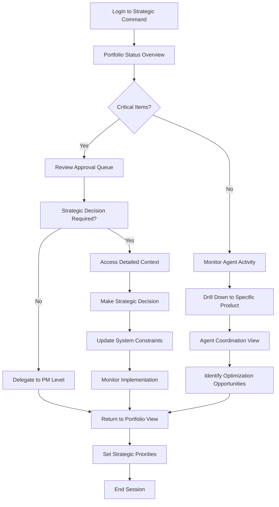
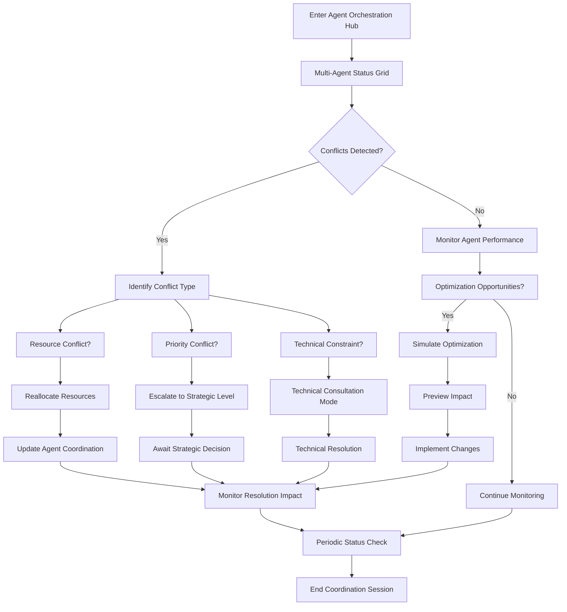
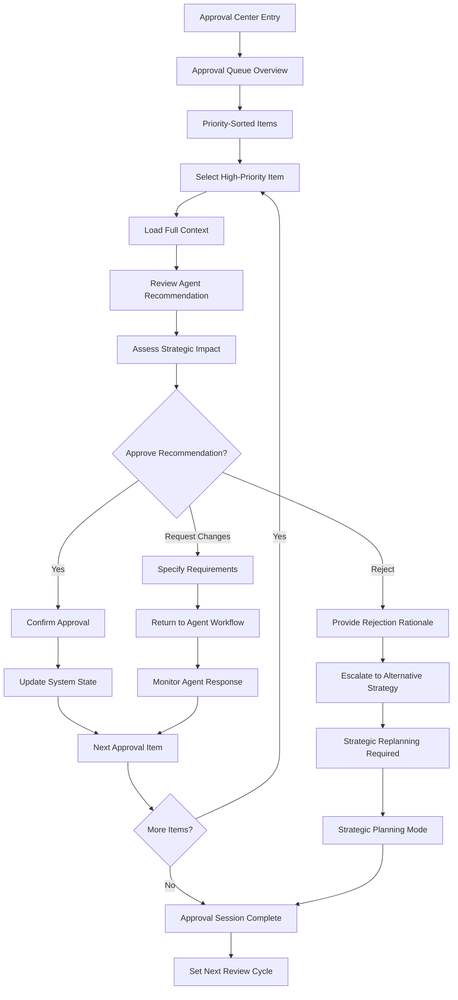

# BMAD Complete Product Orchestration System UI/UX Specification

## Introduction

This document defines the user experience goals, information architecture, user flows, and visual design specifications for BMAD Complete Product Orchestration System's user interface. It serves as the foundation for visual design and frontend development, ensuring a cohesive and user-centered experience for complex autonomous AI orchestration with human strategic oversight.

## Overall UX Goals & Principles

### Target User Personas

**1. Strategic Product Leader (Primary)**
- **Role**: CEOs, Product VPs, Senior PMs who define vision and approve strategic decisions
- **Needs**: High-level orchestration visibility, strategic decision points, quality gate oversight
- **Context**: Manages multiple autonomous product development initiatives simultaneously

**2. Product Manager (Power User)**
- **Role**: John (PM Agent) equivalent - hands-on product execution orchestration
- **Needs**: Detailed sprint coordination, agent collaboration tools, development pipeline control
- **Context**: Daily interaction with system for active product development management

**3. Technical Orchestrator**
- **Role**: System administrators, DevOps engineers managing BMAD infrastructure
- **Needs**: Agent performance monitoring, system health, integration status, troubleshooting
- **Context**: Ensures reliable operation of autonomous development pipeline

### Usability Goals

1. **Strategic Clarity**: Leaders can assess autonomous development status within 30 seconds
2. **Orchestration Control**: PMs can coordinate 5-agent workflows with minimal cognitive overhead
3. **Confidence in Automation**: Clear visibility into AI decision-making with human override capability
4. **Emergency Responsiveness**: Critical issues escalate immediately with clear human action paths

### Design Principles

1. **Transparency over Automation** - Every AI decision must be traceable and explainable
2. **Strategic Control** - Human oversight at every critical decision point, never fully autonomous
3. **Orchestration Clarity** - Complex multi-agent workflows presented as clear, manageable flows
4. **Intelligent Density** - Maximum strategic information with minimal cognitive load
5. **Predictable Patterns** - Consistent interaction patterns across all orchestration interfaces

## Information Architecture (IA)

### Site Map / Screen Inventory

```mermaid
graph TD
    A[Strategic Command Center] --> B[Product Portfolio Dashboard]
    A --> C[Agent Orchestration Hub]
    A --> D[Human Approval Center]
    A --> E[System Administration]

    B --> B1[Active Products Status]
    B --> B2[Product Lifecycle Pipeline]
    B --> B3[Performance Analytics]
    B --> B4[Resource Allocation]

    C --> C1[Agent Activity Monitor]
    C --> C2[Multi-Agent Coordination]
    C --> C3[Workflow Simulation Console]
    C --> C4[Agent Performance Analytics]

    D --> D1[Strategic Approval Queue]
    D --> D2[Quality Gate Reviews]
    D --> D3[Escalation Management]
    D --> D4[Decision Audit Trail]

    E --> E1[System Health Monitor]
    E --> E2[Integration Status]
    E --> E3[Configuration Management]
    E --> E4[User Access Control]

    C1 --> C1A[Mary - Market Intelligence]
    C1 --> C1B[John - Product Strategy]
    C1 --> C1C[James - Technical Architecture]
    C1 --> C1D[Quinn - Quality Engineering]
    C1 --> C1E[Sally - UX Design]

    D1 --> D1A[Research Phase Approvals]
    D1 --> D1B[Architecture Decisions]
    D1 --> D1C[Quality Gate Confirmations]
    D1 --> D1D[Market Strategy Changes]
```

### Navigation Structure

**Primary Navigation**: Context-aware top-level navigation that adapts based on user role and current system state:
- Strategic Command Center (always accessible for oversight)
- Product Portfolio (filtered by user permissions)
- Agent Orchestration (real-time activity center)
- Approval Center (personalized queue)
- System Admin (role-based access)

**Secondary Navigation**: Contextual sidebar navigation within each primary area:
- Filters and views for complex data sets
- Quick actions for common operations
- Real-time status indicators and alerts
- Cross-functional collaboration tools

**Breadcrumb Strategy**: Intelligent breadcrumbs showing both hierarchical location and workflow context:
- Standard hierarchy: Strategic Command > Product Portfolio > [Product Name]
- Workflow context: Research Phase > Market Analysis > Competitive Intelligence
- Agent context: Agent Orchestration > Mary (Analyst) > Active Research Tasks

## User Flows

### 1. Strategic Product Orchestration Oversight

**User Goal:** Monitor and guide autonomous product development across multiple concurrent projects

**Entry Points:**
- Direct login to Strategic Command Center
- Alert notifications requiring strategic input
- Scheduled product review cycles

**Success Criteria:**
- Clear understanding of all product statuses within 60 seconds
- Ability to identify and act on strategic decisions requiring human input
- Confidence in autonomous progress without micromanagement

#### Flow Diagram

**Edge Cases & Error Handling:**
- Agent conflict requiring immediate human resolution
- System performance degradation affecting multiple products
- External market changes requiring strategy adjustment
- Quality gate failures requiring strategic re-prioritization

### 2. Real-Time Agent Coordination Management

**User Goal:** Monitor and coordinate multi-agent workflows for active product development

**Entry Points:**
- Agent Activity Monitor dashboard
- Escalation alerts from specific agents
- Scheduled coordination check-ins

**Success Criteria:**
- Real-time visibility into all agent activities and interdependencies
- Ability to resolve agent conflicts and bottlenecks
- Coordination optimization without disrupting autonomous flow

#### Flow Diagram

**Edge Cases & Error Handling:**
- Agent performance degradation requiring intervention
- Cascade failures affecting multiple agents
- External dependency failures (APIs, integrations)
- Unexpected agent behavior requiring manual override

### 3. Human Approval Workflow Management

**User Goal:** Process strategic approvals efficiently while maintaining quality oversight

**Entry Points:**
- Approval Center notifications
- Quality gate escalations
- Strategic decision requirements

**Success Criteria:**
- Clear understanding of approval context and implications
- Efficient decision-making with complete information
- Audit trail of all strategic decisions

#### Flow Diagram

**Edge Cases & Error Handling:**
- Insufficient context for strategic decision
- Conflicting agent recommendations requiring mediation
- Time-sensitive approvals requiring expedited process
- Approval dependencies blocking multiple workflows

## Wireframes & Mockups

**Primary Design Files:** Design system will be created in Figma with component library and interactive prototypes for complex orchestration flows

### Key Screen Layouts

#### 1. Strategic Command Center Dashboard

**Purpose:** High-level executive overview of all autonomous product development initiatives with strategic decision points

**Key Elements:**
- Product Portfolio Status Grid (5x3 grid showing Research→Ideation→PRD→Development→Validation phases)
- Strategic Approval Queue (prioritized list with urgency indicators and context previews)
- Multi-Agent Performance Heartbeat (real-time system health visualization)
- Market Intelligence Feed (AI-curated strategic insights from Mary)
- Resource Allocation Overview (human and AI resource utilization across products)
- Executive Decision Analytics (impact tracking of strategic decisions)

**Interaction Notes:** Hover states reveal detailed tooltips, click-through provides contextual drill-down without losing dashboard context. Strategic approval items support quick approve/reject/investigate actions directly from dashboard.

**Design File Reference:** `/strategic-command-center/dashboard-overview`

#### 2. Agent Activity Monitor

**Purpose:** Real-time visualization of 5-agent coordination with detailed workflow states and interdependency mapping

**Key Elements:**
- Agent Status Network (interactive node graph showing Mary→John→James→Quinn→Sally coordination)
- Active Task Pipeline (swimlane view of tasks flowing between agents)
- Agent Performance Metrics (productivity, quality scores, response times)
- Workflow Bottleneck Detection (automatic identification and resolution suggestions)
- Cross-Agent Communication Log (filtered message stream with sentiment analysis)
- Agent Override Controls (emergency stop, priority adjustment, manual task assignment)

**Interaction Notes:** Network graph supports zoom/pan for detailed agent inspection. Swimlanes are draggable for task re-prioritization. Real-time updates with smooth transitions to maintain spatial orientation.

**Design File Reference:** `/agent-orchestration/activity-monitor-main`

#### 3. Human Approval Interface

**Purpose:** Context-rich approval workflow enabling informed strategic decisions with complete AI recommendation analysis

**Key Elements:**
- Approval Item Detail Panel (full context: agent recommendation, analysis, impact assessment)
- Decision History Sidebar (previous related decisions with outcomes)
- Strategic Impact Visualization (projected outcomes of approve/reject/modify decisions)
- Collaboration Context (which agents/humans involved, timeline, dependencies)
- Quick Decision Actions (approve, request changes, reject, escalate, delegate)
- Decision Rationale Capture (structured input for decision reasoning and constraints)

**Interaction Notes:** Split-screen layout allows comparison of multiple related approvals. Expandable sections provide progressive disclosure of technical details. Decision actions include confidence indicators and reversibility options.

**Design File Reference:** `/approval-workflows/decision-interface`

#### 4. Command Simulation Console

**Purpose:** Safe testing environment for orchestration changes and scenario planning before affecting live systems

**Key Elements:**
- Simulation Environment Setup (copy current state, define test parameters)
- Virtual Agent Coordination (simulated 5-agent interaction with accelerated timeline)
- Scenario Impact Prediction (projected outcomes with confidence intervals)
- A/B Testing Framework (compare different orchestration strategies)
- Rollback Safety Controls (safe simulation boundaries and reset capabilities)
- Learning Integration (capture simulation insights for real system optimization)

**Interaction Notes:** Console-style interface with command-line efficiency combined with visual feedback. Real-time simulation progress with ability to pause/inspect/modify mid-simulation. Clear visual distinction from live system.

**Design File Reference:** `/simulation-console/main-interface`

## Component Library / Design System

**Design System Approach:** Custom design system built specifically for AI orchestration interfaces, combining elements from enterprise dashboards (data density) and command centers (real-time monitoring) with novel components for human-AI collaboration workflows.

### Core Components

#### 1. Agent Status Indicator

**Purpose:** Real-time visual representation of individual AI agent states with performance and activity context

**Variants:**
- Compact (icon + status dot for overview grids)
- Detailed (avatar + metrics + current task for focused views)
- Network (node representation for agent relationship diagrams)

**States:** Active/Working, Idle/Waiting, Blocked/Error, Override/Manual, Offline/Maintenance

**Usage Guidelines:** Always paired with agent identity (Mary/John/James/Quinn/Sally), includes last activity timestamp, supports click-through to agent detail view

#### 2. Strategic Decision Card

**Purpose:** Structured presentation of approval items requiring human strategic input with AI recommendation context

**Variants:**
- Summary (title + urgency + quick actions for queue views)
- Detailed (full context + impact analysis for decision-making)
- Historical (archived decisions with outcomes for reference)

**States:** Pending Review, Under Review, Approved, Rejected, Escalated, Implemented

**Usage Guidelines:** Must include agent recommendation, strategic impact assessment, and decision rationale capture. Color coding by urgency and decision type.

#### 3. Orchestration Timeline

**Purpose:** Visual representation of multi-agent workflow progression through product development phases

**Variants:**
- Horizontal (traditional timeline for individual product tracking)
- Vertical (compressed timeline for multi-product overviews)
- Interactive (drag-and-drop for simulation and planning)

**States:** Future/Planned, Active/In Progress, Completed/Success, Blocked/Issue, Modified/Replanned

**Usage Guidelines:** Shows agent handoffs, dependencies, and quality gates. Supports zoom levels from high-level phases to detailed task progression.

#### 4. Performance Metrics Display

**Purpose:** Real-time and historical performance data visualization for agents, products, and system health

**Variants:**
- Gauge (single metric with thresholds and trends)
- Multi-metric (dashboard widget with multiple related KPIs)
- Comparative (side-by-side agent or product comparisons)

**States:** Normal/Green, Warning/Yellow, Critical/Red, Unknown/Gray

**Usage Guidelines:** Always includes trend direction, contextual thresholds, and drill-down capability. Color coding must be accessible and consistent across all metrics.

#### 5. Command Interface Panel

**Purpose:** Console-style interface for direct system interaction, simulation controls, and advanced configuration

**Variants:**
- Compact (embedded commands within other interfaces)
- Full Console (dedicated command environment for power users)
- Simulation (safe testing environment with clear boundaries)

**States:** Ready, Processing, Success, Error, Simulation Mode

**Usage Guidelines:** Clear visual distinction between simulation and live commands. Includes command history, auto-completion, and safety confirmations for destructive actions.

## Branding & Style Guide

**Brand Guidelines:** Enterprise AI orchestration system requiring trust, sophistication, and operational clarity. Visual identity should convey cutting-edge AI capability while maintaining approachable human control.

### Color Palette

| Color Type | Hex Code | Usage |
|------------|----------|--------|
| Primary | #1a365d | Strategic command elements, primary navigation, executive controls |
| Secondary | #2b77ad | Agent status indicators, active workflow elements |
| Accent | #0ea5e9 | Interactive elements, notifications, real-time updates |
| Success | #059669 | Agent completion states, approved decisions, system health |
| Warning | #d97706 | Attention required, escalations, performance alerts |
| Error | #dc2626 | Critical issues, failed processes, blocking errors |
| Neutral | #374151, #6b7280, #d1d5db | Text hierarchies, borders, background layers |

### Typography

#### Font Families
- **Primary:** Inter (clean, readable, enterprise-standard for strategic interfaces)
- **Secondary:** JetBrains Mono (technical elements, code, agent communications)
- **Display:** Space Grotesk (dashboard headings, strategic emphasis)

#### Type Scale

| Element | Size | Weight | Line Height |
|---------|------|--------|-------------|
| H1 | 2.25rem (36px) | 700 | 1.2 |
| H2 | 1.875rem (30px) | 600 | 1.3 |
| H3 | 1.5rem (24px) | 600 | 1.4 |
| Body | 1rem (16px) | 400 | 1.6 |
| Small | 0.875rem (14px) | 400 | 1.5 |

### Iconography

**Icon Library:** Heroicons v2 with custom AI orchestration icons (agent avatars, workflow states, strategic indicators)

**Usage Guidelines:** Consistent 24px grid system, outline style for interactive elements, filled style for status indicators. Custom agent avatars use consistent geometric styling with color coding.

### Spacing & Layout

**Grid System:** 8px base unit with 12-column responsive grid. Dense information layouts use 4px micro-spacing, strategic overview uses 16px+ spacing for breathing room.

**Spacing Scale:** 4px, 8px, 12px, 16px, 24px, 32px, 48px, 64px - optimized for information density while maintaining visual hierarchy.

## Accessibility Requirements

**Standard:** WCAG 2.1 AA compliance with enhanced requirements for complex data visualization and real-time monitoring interfaces

### Key Requirements

**Visual:**
- Color contrast ratios: 4.5:1 minimum for normal text, 3:1 for large text, 7:1 for critical strategic information
- Focus indicators: 2px outline with high contrast for all interactive elements, enhanced 4px indicators for strategic decision controls
- Text sizing: Minimum 16px for body text, scalable to 200% without horizontal scrolling, enhanced readability for dense information displays

**Interaction:**
- Keyboard navigation: Full keyboard access with logical tab order through complex agent coordination interfaces, custom shortcuts for frequent strategic actions
- Screen reader support: Comprehensive ARIA labels for agent states, live regions for real-time updates, structured headings for complex dashboard navigation
- Touch targets: Minimum 44px for mobile interfaces, enhanced 48px for critical approval actions, adequate spacing for dense control interfaces

**Content:**
- Alternative text: Descriptive alt text for agent status visualizations, detailed descriptions for complex workflow diagrams and performance charts
- Heading structure: Logical hierarchy supporting complex information architecture, consistent patterns across orchestration interfaces
- Form labels: Clear labeling for all strategic decision inputs, contextual help for complex approval workflows

### Testing Strategy

Comprehensive accessibility testing including automated scanning (axe-core), manual keyboard navigation testing, screen reader testing (NVDA, JAWS, VoiceOver), and user testing with accessibility-dependent users. Special focus on complex data visualization accessibility and real-time update announcements.

## Responsiveness Strategy

### Breakpoints

| Breakpoint | Min Width | Max Width | Target Devices |
|------------|-----------|-----------|----------------|
| Mobile | 320px | 767px | Smartphones, emergency mobile access |
| Tablet | 768px | 1023px | Tablets, portable strategic oversight |
| Desktop | 1024px | 1439px | Standard workstations, primary interface |
| Wide | 1440px | - | Large displays, command center setups |

### Adaptation Patterns

**Layout Changes:**
- Mobile: Single-column priority stacking (strategic approvals → agent status → performance metrics)
- Tablet: Two-column layout with collapsible sidebars for agent coordination
- Desktop: Full multi-panel layout with persistent navigation and real-time monitoring
- Wide: Enhanced multi-monitor support with dedicated agent coordination displays

**Navigation Changes:**
- Mobile: Hamburger menu with priority-based quick actions, bottom tab bar for core functions
- Tablet: Collapsible sidebar navigation with gesture support for rapid context switching
- Desktop: Full persistent navigation with breadcrumbs and contextual secondary menus
- Wide: Expanded navigation with always-visible secondary navigation and tool palettes

**Content Priority:**
- Mobile: Strategic approval queue prioritized, agent details on-demand, simplified metrics
- Tablet: Strategic overview + single agent focus, expandable detail panels
- Desktop: Full strategic command center with all agent coordination visible
- Wide: Enhanced multi-agent visualization with expanded analytics and simulation tools

**Interaction Changes:**
- Mobile: Touch-optimized controls, swipe gestures for approval workflows, simplified decision paths
- Tablet: Hybrid touch/precision controls, drag-and-drop for agent task management
- Desktop: Mouse-optimized workflows, keyboard shortcuts, complex multi-selection
- Wide: Advanced interaction modes, multi-cursor support, collaborative viewing modes

## Animation & Micro-interactions

**Motion Principles:**
- **Purposeful Animation**: Every animation serves strategic understanding or operational feedback
- **Respectful Motion**: Subtle, professional animations appropriate for executive decision-making contexts
- **Spatial Continuity**: Animations maintain spatial relationships in complex agent coordination views
- **Performance Awareness**: Smooth 60fps performance even with multiple real-time agent updates
- **Accessibility First**: Reduced motion support with alternate feedback mechanisms

### Key Animations

- **Agent Status Transitions:** Smooth color/icon morphing when agents change states (Duration: 300ms, Easing: ease-out)
- **Strategic Approval Cascade:** Gentle highlighting flow showing approval impact through agent network (Duration: 800ms, Easing: cubic-bezier(0.4, 0, 0.2, 1))
- **Real-time Data Updates:** Subtle pulse/glow effects for new information without disrupting focus (Duration: 200ms, Easing: ease-in-out)
- **Agent Coordination Flow:** Animated pathways showing task handoffs between agents (Duration: 1200ms, Easing: ease-in-out)
- **Strategic Decision Feedback:** Satisfying confirmation animation for critical approvals (Duration: 500ms, Easing: spring(1, 100, 10))
- **System Health Pulse:** Gentle breathing animation for overall system status indicator (Duration: 2000ms, Easing: sine wave)
- **Workflow Timeline Progress:** Smooth progress indicators showing autonomous development advancement (Duration: 400ms, Easing: ease-out)
- **Emergency Alert Escalation:** Attention-grabbing but not jarring animation for critical issues (Duration: 600ms, Easing: ease-in-out, with pause intervals)

## Performance Considerations

### Performance Goals

- **Page Load:** Sub-2 second initial dashboard load, sub-1 second for cached strategic views
- **Interaction Response:** Sub-100ms response for all strategic decision controls, sub-200ms for complex agent coordination actions
- **Animation FPS:** Consistent 60fps for all motion design, graceful degradation to 30fps under heavy agent activity

### Design Strategies

**Real-time Data Optimization:** Intelligent data streaming with priority-based updates (strategic approvals > agent status > performance metrics), WebSocket connections with automatic reconnection, smart batching of non-critical updates to prevent interface flooding.

**Progressive Loading:** Strategic information loads first (approval queue, critical alerts), followed by agent coordination details, then historical analytics. Skeleton screens maintain spatial layout during loading phases.

**Interaction Responsiveness:** Optimistic UI updates for strategic decisions with rollback capability, immediate visual feedback for all controls, intelligent preloading of likely next actions based on workflow patterns.

**Resource Management:** Lazy loading of complex visualizations, efficient memory management for real-time agent network displays, automatic cleanup of historical data beyond strategic relevance timeframes.

## Next Steps

### Immediate Actions

1. **Stakeholder Review and Approval** - Present specification to strategic leadership for approval of UX approach and component complexity
2. **Technical Architecture Alignment** - Coordinate with system architects to ensure UI specifications align with BMAD autonomous orchestration capabilities
3. **Agent Integration Planning** - Define specific UI integration points with Mary, John, James, Quinn, and Sally agent workflows
4. **Design System Development** - Begin Figma component library creation with focus on novel AI orchestration components
5. **Performance Architecture Planning** - Establish technical foundation for real-time multi-agent coordination interfaces
6. **Accessibility Implementation Strategy** - Define development approach for complex data visualization accessibility
7. **Responsive Development Framework** - Establish responsive development methodology for complex enterprise interfaces

### Design Handoff Checklist

- [x] All user flows documented
- [x] Component inventory complete
- [x] Accessibility requirements defined
- [x] Responsive strategy clear
- [x] Brand guidelines incorporated
- [x] Performance goals established

**Implementation Priority Recommendations**:

**Phase 1 (Weeks 1-2)**: Strategic Command Center Dashboard + Agent Status components
**Phase 2 (Weeks 3-4)**: Human Approval Interface + Strategic Decision workflows
**Phase 3 (Weeks 5-6)**: Agent Activity Monitor + Real-time coordination visualization
**Phase 4 (Weeks 7-8)**: Command Simulation Console + Advanced orchestration features

**Critical Success Factors**:
- Maintain strategic human oversight capability throughout development
- Ensure AI agent integration points are clearly defined and testable
- Prioritize strategic decision-making workflows over operational convenience features
- Validate complex interface usability with target strategic users early and frequently

**Risk Mitigation**:
- Complex multi-agent visualization may require iterative design refinement
- Real-time performance requirements may constrain visual sophistication
- Strategic user adoption depends on immediate value demonstration
- Agent coordination interfaces represent novel interaction patterns requiring user education

---

This comprehensive UX specification provides the foundation for implementing sophisticated human-AI collaboration interfaces that enable strategic oversight of autonomous product development orchestration while maintaining the operational excellence and strategic control essential for enterprise AI adoption.